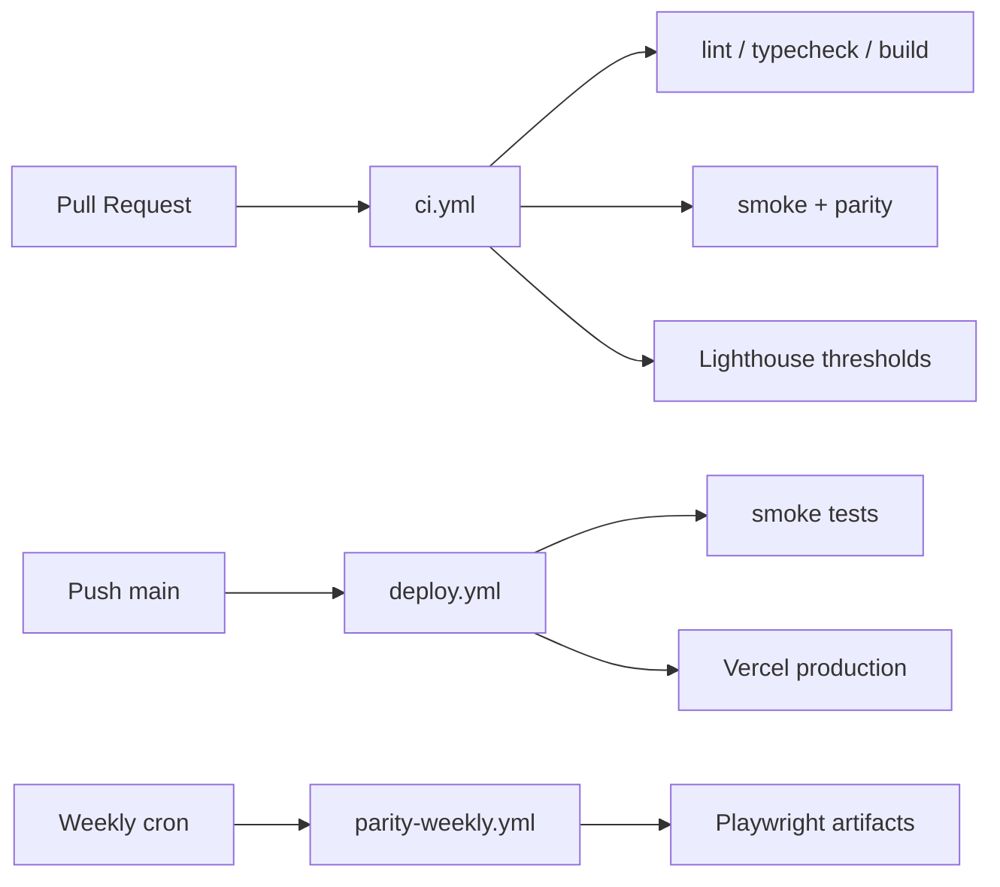

# Engineering Report — CI/CD & Long-Term Maintenance

**Project:** LOUD SRL Next.js clone  
**Status:** Release candidate with automated pipeline  
**Date:** 2026-05-31

---

## 1. CI/CD overview

| Workflow | Trigger | Purpose |
|----------|---------|---------|
| [`ci.yml`](../.github/workflows/ci.yml) | PR + push `main` | Quality gate: lint, types, build, smoke, CI parity, Lighthouse |
| [`deploy.yml`](../.github/workflows/deploy.yml) | Push `main` | Smoke + Vercel `--prod` deploy |
| [`parity-weekly.yml`](../.github/workflows/parity-weekly.yml) | Mon 06:00 UTC + manual | Full parity matrix, drift detection |

**Merge policy:** All `ci.yml` jobs must pass. No auto-merge without green checks.

---

## 2. Deployment workflow

### Paths

1. **Vercel Git** — zero-config previews; production on merge (recommended for teams)
2. **GitHub Actions** — `deploy.yml` uses `amondnet/vercel-action` when secrets are set

### Build artifact

- Next.js static/SSG pages + API routes (`/api/contact`, `/api/location`)
- 31 routes including `robots.txt`, `sitemap.xml`

### Environment separation

| Env | `CONTACT_REQUIRE_WEBHOOK` | Analytics |
|-----|---------------------------|-----------|
| Local | optional | off / dev |
| Preview | recommended | on |
| Production | **required** | on |

---

## 3. Regression protection strategy

### Layers

| Layer | Tool | Scope |
|-------|------|--------|
| Static analysis | ESLint + TypeScript | Code quality |
| Smoke | `tests/release-smoke.spec.ts` | Critical paths, API, a11y skip link |
| Visual parity | `tests/parity-against-live.spec.ts` | Screenshot vs baselines |
| Menu state | `tests/parity-menu.spec.ts` | Mobile menu open |
| Lighthouse | `scripts/lighthouse-ci.mjs` | Perf ≥85 (home ≥68), A11y ≥90 |
| Weekly full | `parity-weekly.yml` | Extended routes + all viewports |

### Determinism techniques

- Frozen `Date` in parity tests
- Cookie banner dismissed via `localStorage`
- GSAP/video paused; CSS animations disabled
- `document.fonts.ready` before capture
- CI: 2 viewports, 6 routes with committed baselines only
- `test.skip` when baseline PNG missing

### Artifacts on failure

- `playwright-report/` (14 days on PR CI)
- `test-results/results.json` → `scripts/parity-diff-report.mjs`
- `docs/lighthouse/summary.json` (30 days)

---

## 4. Monitoring strategy

| Signal | Implementation |
|--------|----------------|
| Client errors | `app/error.tsx`, `app/global-error.tsx`, `ErrorBoundary` |
| Error reporting | `lib/observability/reportError.ts` + optional `NEXT_PUBLIC_ERROR_REPORT_URL` |
| Contact failures | `submitContact` → `reportError`; API structured logs |
| Image failures | `MediaImage` `onError` → warning report + placeholder |
| WebGL | Context loss → static black fallback |
| Traffic & vitals | `@vercel/analytics`, `@vercel/speed-insights` |
| Custom vitals | `NEXT_PUBLIC_REPORT_WEB_VITALS=true` |

### Optional upgrades

- `@sentry/nextjs` in `reportError`
- Vercel Log Drains for `/api/contact` 5xx
- Uptime check on `/` and `/api/contact` (HEAD/GET)

---

## 5. Final production checklist

- [ ] GitHub secrets: `VERCEL_*` (if using Actions deploy)
- [ ] Vercel env: `CONTACT_WEBHOOK_URL`, `NEXT_PUBLIC_SITE_URL`
- [ ] Custom domain + SSL
- [ ] Smoke test on production URL
- [ ] Contact form end-to-end + webhook payload
- [ ] `robots.txt` / `sitemap.xml` reachable
- [ ] CI green on `main`
- [ ] Parity baselines committed for any new `PARITY_CI_ROUTES`

---

## 6. Known technical debt

| Item | Impact | Mitigation |
|------|--------|------------|
| Some `public/media/*.svg` placeholders | Visual on edge cards | `media:sync`, `mediaSrc()` fallback |
| Home Lighthouse perf | CI uses lower home threshold (68) | Expected for WebGL |
| Parity baselines incomplete for design/develop pillars | Not in CI until captured | Weekly workflow + manual capture |
| Contact attachments as base64 | Webhook payload size | Future: S3 presigned upload |
| `tests/lib/parity.ts` uses `fs` | Node-only (Playwright OK) | Excluded from Next `tsconfig` |

---

## 7. Recommended future improvements

1. **Required status checks** on `main`: `quality`, `e2e`, `lighthouse`
2. **Chromatic or Percy** if team grows beyond Playwright baselines
3. **Preview parity** — run smoke against Vercel preview URL on PR
4. **Dependabot** — `/.github/dependabot.yml` for npm + Actions
5. **Sentry release tracking** tied to Vercel deployment ID
6. **E2E on WebKit** — optional job for Safari regression
7. **Bundle size budget** in CI via `@next/bundle-analyzer` output comparison

---

## 8. Developer experience summary

| Task | Command |
|------|---------|
| Full local CI | `npm run ci && npm run test:smoke` |
| Update parity | `npm run test:parity:capture` |
| Bundle analysis | `npm run analyze` |
| Sync assets | `npm run media:sync` |

**Docs:** [README.md](../README.md) · [CONTRIBUTING.md](../CONTRIBUTING.md) · [DEPLOYMENT_GUIDE.md](./DEPLOYMENT_GUIDE.md)

---

*This pipeline is designed for long-term agency maintenance: small PRs, automated gates, and visual contracts without blocking day-to-day content edits.*
